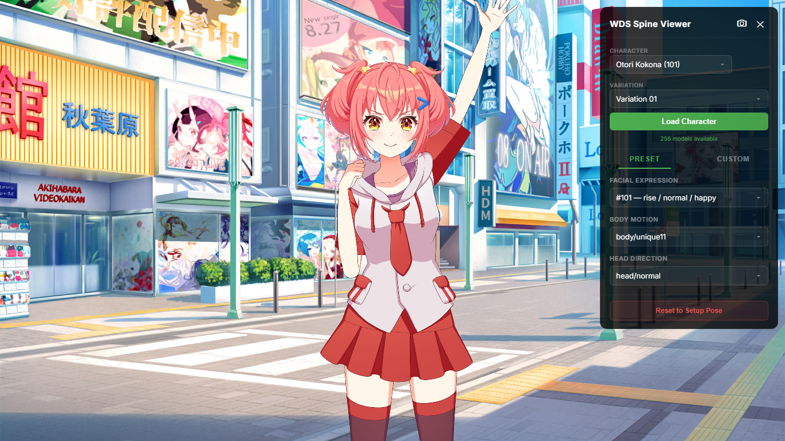

<div align="center">
  
  <hr>
</div>

<div align="center">
  
  
  
  
</div>

## About
A spine character viewer for game [ワールドダイスター 夢のステラリウム](https://world-dai-star.com/game).

## Demo
[Online Demo](https://wds-char-viewer.pages.dev)

## URL Parameters

| Parameters  | description | value |
| :-------------: | :-------------: | :-------------:|
|renderer  | Renderer Type | `webgl`, `webgpu` |

Example : 
 - `https://wds-char-viewer.pages.dev/?renderer=webgl`

## Quick Start

```shell
# Install dependencies
yarn install

# Start development server
yarn run dev

# Build for production
yarn run build
```